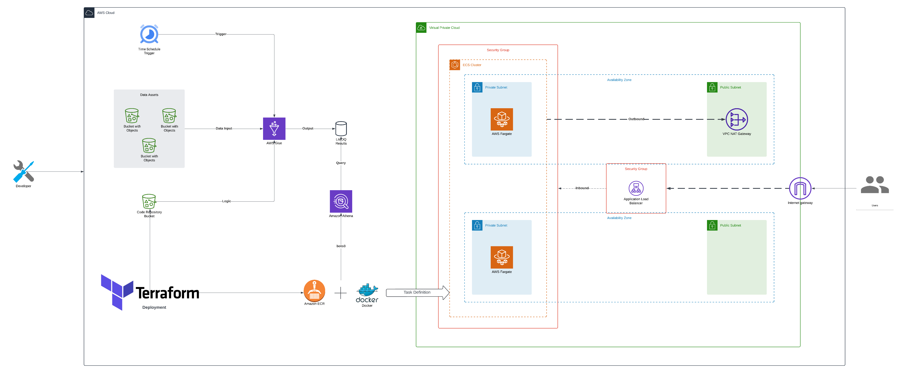

<p align="center">
  
</p>

# Description

> [!WARNING]
> LiteDQ is currently a project under construction.

_LiteDQ_ / _Lite Data Questions_ / _Lite Data Quality_ is small data quality framework that helps implementing
both complex and simple logic checks that aim at monitoring the health of your data assets in AWS.

## Fundamentals

The tool is based on the concept of **Questions**, **Subjects** and **Applications**.
* **Question**: a small unit of code represting the operations needed to perform an arbitrary check over a given asset and table.
* **Subject**: the minimum representation of data over which the check is applied coupled with the global result of the check.
* **Application**: A question and its subject can be reused across different assets, tables or columns, thus the execution of the same check over different inputs receives the name of application.

>[!TIP]
> Keep in mind that while using generelized checks is encouraged for a healthier code base, one shouldn't force the over-generalization of a question if there isn't a need for it, thus questions designed for a single application is fine as well.

## Requirements

To be able to deploy the infrastructure the developer we'll need to have a basic understanding and installation of:
* Terraform
* Docker
* AWS VPC
* zip

## Usage

The Terraform module is built around a small python package that streamlines data quality checks definition and maintainance
by implementing the concepts described above. 
In order to avoid complex wrappers and structures, litedq only enforces the user the definition of three main aspects: an entrypoint for the custom logic, the checks definition as python functions and an _explicit_ application of those functions to a dataframe like type.

### Entrypoint
The entrypoint of the will act as the first custom logic defined by the user that will be executed by the deployed Glue job. In order to take care of  of the bootstrapping, litedq requires the partial implementation of the `Executor` class which needs to implement the `ask` method:

```python
from bootstrap import BaseExecutor

class Executor(BaseExecutor):
    def ask(self):
        """
        Custom logic and applications
        """
```

In order to define it, a parent class `BaseExecutor` is provided and made available as dependency in the deployment stage through the internal `bootstrap` package.


### Question Definition
Defining questions or checks translates in its most basic form to defining a function in python inside an arbitrary pseudo-package which we'll call
_respository_. However, for litedq to manage these functions they need to defined in a specific way, a simple implementation would look like the following:
```python
from litedq import Subject, DataQuestions as dq

@dq.register("check_unique_id", "Detailed check description")
def check(accounts_df, spark):
    """
    Custom logic to retrieve a boolean result and a subject in dataframe form
    """
    return Subject(result, df)
```

In the above sample we can observe the following elements:
* an import of the `Subject` and `DataQuestions` class.
* a function decorated with the `register` method from `DataQuestions` with a unique string id per check and a free text description of what is being done by the function.
    * The function can specify any number and type of arguments needed by the check (in this case, the dataframe and a spark session)
* a mandatory return of a `Subject` instance using as arguments the boolean result and an optional dataframe like object with the relevant calculations.

Every question needs to follow the same structure in order be executed by litedq, reusing ids, name functions and not returning the appropiate type
will raise an exception.


### Question Application
Finally, once we've defined the questions we can apply them to different data assets in the entrypoint. While the questions can be inside any module, even the entrypoint, in order to simplify code readability litedq will make available your definitions through the `questions` package start import.
Using as an example the previous check, the entrypoint would have the following pseudo-implementation: 
```python
from bootstrap import BaseExecutor
from questions import *

from litedq import DataQuestions as dq

# Other imports...

class Executor(BaseExecutor):
    def ask(self):
        """
        Custom logic and applications
        """

        # Apply check to accounts_df
        dq["check_unique_id"].apply(accounts_df=accounts_df, spark=spark)
```

>[!WARNING]
> Note that the arguments for the check are specified by their name, this is required to properly map the parameters needed by your check


### Deployment

#### Variables
| **Variable**            	| **Sample Vale** 	| **Description**                                             	|
|-------------------------	|-----------------	|-------------------------------------------------------------	|
| **job_name**            	| dq-data-logger  	| Name of the Glue job                                        	|
| **code_repo_bucket**    	| aws-glue-assets 	| Bucket where the logic will be stored for Glue              	|
| **code_path**           	| ./main.py       	| Path where the entrypoint logic is stored                   	|
| **questions_path**      	| ./questions     	| Path where the questions folder is located                  	|
| **target_bucket**       	| aws-data-logger 	| Bucket where the results will be stored                     	|
| **target_database**     	| dataloggger     	| Database name for the results will b stored                 	|
| **target_table**        	| logs            	| Table name where the results will be stored                 	|
| **write_mode**          	| append          	| Write mode for the results (can be "append" or "overwrite") 	|
| **dry_run**             	| false           	| Whether to write the results or not                         	|
| **vpc_name**            	| litedqp-vpc     	| Name of then VPC to be created by the module                	|
| **dash_docker_context** 	|                 	| Context path to use for custom frontend deployment     

> [!NOTE]
> If the buckets and database don't exists the blueprint will create them you.

### Practical Example
First of all, create a new project folder or Git repository and retrieve your AWS credentials to be able to deploy using Terraform. Considering the newly created folder as your working directory:
1. Create a `main.tf` file with the following skeleton:
```terraform
module "dqlogger" {
  source = "https://github.com/0xDEADCALL/litedq"

  // Glue params
  job_name = "dq-data-logger"

  // Bucket variables
  code_repo_bucket = "aws-glue-assets-sample"
  code_path        = "./main.py"
  questions_path   = "./questions"

  // Database name
  target_bucket   = "aws-data-logger-sample"
  target_database = "datalogger"
  target_table    = "logs"

  // Write mode
  write_mode = "append"

  // Don't write anything
  dry_run = false

  // VPC Name
  vpc_name = "litedq-vpc"
}

output "alb_hostname" {
  value = "App Link: ${module.dqlogger.alb_hostname}"
}
```
For more details in the different variables, please see the[Variables](#variables) section.

2. Create a `questions` folder (this can have any name, however we referenced it as this in the previous step in `questions_path`)

3. Define the questions inside python modules in the newly created folder. Any level of subfolders can be used to organize the diferent checks, they will be recursively loaded. As an example, we'll define a check using spark logic inside a `spark` folder

```python
# Spark imports
from pyspark.sql import functions as F
from pyspark.sql.functions import col, lit

# Imports related to liteDQ
from litedq import DataQuestions as dq
from litedq import Subject

@dq.register("check_countries_df", "Check all the countries are present")
def check_countries_df(accounts_df, spark):
    df = accounts_df.select("office_location").distinct()
    loc_check = df.count() == 15

    return Subject(loc_check, df)
```
In this case, we're going to check a Spark dataframe has only 15 different countries and return as a subject the countries available as well as the actual result as a boolean.

For more information on how to write checks, please see [Question Definition](#question-definition).

4. Load and preprocess the necessary data inside the `main.py` script
```python
from pyspark.sql.dataframe import DataFrame as sparkDataFrame

# LiteDQ relate imports
from bootstrap import BaseExecutor
from litedq import DataQuestions as dq


# Define entrypoint
class Executor(BaseExecutor):
    def ask(self):
        # Load the by reading from a bucket
        S3_SOURCE = "s3://your-s3-bucket"

        # Retrieve data
        accounts_df: sparkDataFrame = (self.spark.read
            .option("header", True)
            .option("inferSchema", "true")
            .csv(f"{S3_SOURCE}/accounts.csv")
        )

        # Load the data using spark SQL
        # accounts_df = spark.sqk("SELECT * FROM yourdatabase.accounts")
      
        # Apply the check you've defined previously using the "ID"
```

## Technical Implementation



The main logic will be run in a Glue job outputing the resulsts in the specified bucekt `target_bucket` where a database will be created
for querying through Athena. Later this will be used to deploy a basic dashboaard with the metrics collected from the given database where the litedq module will create the necessary infrastructure for you to deploy a streamlit based dashboard by default (note that any custom webapp can be deploted as long its defined as a docker image by specifying the proper docker context using the `docker_dash_context` variable).

